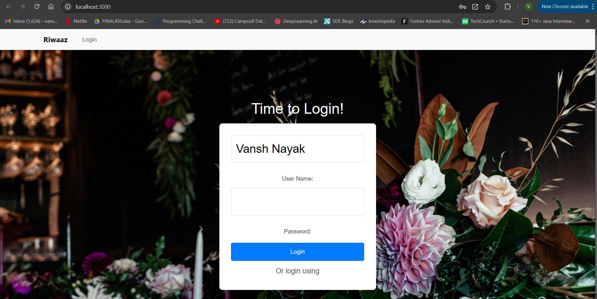

# 📚 Project Title: RIWAAZ

Welcome to the **Riwaaz** repository! 

Till Now i have used springboot to build robut and strong api

Develop POST DELETE GET method to fetch and create event along with  target Date ,desciption and Delete,create button 

I have integrated with react framework  used Axios to link with localhost:3000 backend to frontend localhost:8080

I have mainly focused on security and i have used JWT tokens to build site  more strong

Also i used JPA SQL to integrate with database create jpa repository for real time monitoring

for phase 2 i am showing code of my backend 

also i want to used redis for cache memory uses for more efficient and fast which helps in scalablity but there is problem and short of time(future Scope)

CODE EXPLAIN

1) first i have created a todo(Task) template which is POJO class where i used field and constructed getter ans setter i have also used entity to automatic table that provides by spring jpa 
2) TaskService  i have used list for im memory database but later on i integrated with jpa(TodoService)
3) For business logic and all my api endpoints i created @service (TodoResources)
4) for integrating with database i used @repository (todoRepository) which is interfaces and extends jpa
5) there is separte package for jwt all my corse poilcy are there as a front security firewall
   

## 🚀 Features

- **CRUD Operations:** Complete Create, Read, Update, and Delete operations.
- **Validation:** Robust input validation ensuring data integrity.
- **Exception Handling:** Custom exception handling for a seamless user experience.
- **Data Formats:** Supports both JSON and XML responses.
- **Authentication:** Custom-built authentication mechanism.
- **Database Integration:** Seamless interaction with databases using JPA and Hibernate.

## 🛠️ Technology Stack

- **Backend:** Java, Spring Boot
- **Database:** JPA with Hibernate (MySQL/PostgreSQL)
- **Testing:** Postman for API testing
- **Tools:** IntelliJ IDEA, Maven, Git
